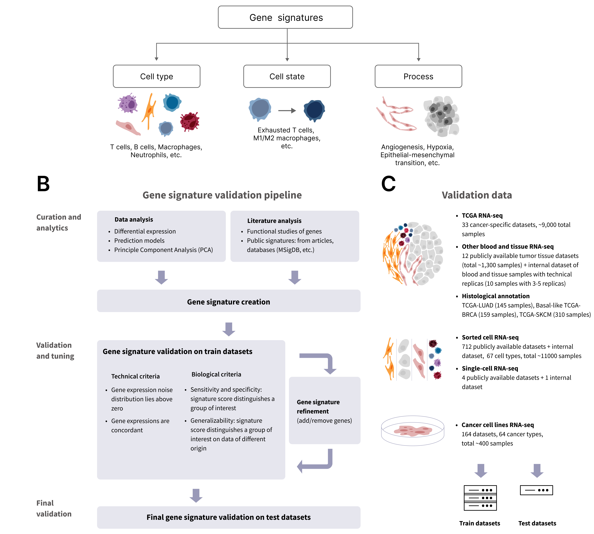

# Signature_Validation

Code and figures for the paper **"Analytical validation pipeline for generating highly specific
functional gene expression signatures"** (BostonGene).

## Abstract

Functional gene expression signatures (FGESs) are commonly used in tumor transcriptomic analyses,
including in predictive and prognostic models. However, creating and validating FGES remain
challenging due to technical and biological limitations that prevent the establishment of reliable
quality assessment criteria for FGES. Here, we describe a comprehensive pipeline for developing and
validating FGESs that includes 1) creating a gene set using both computational and analytical
methods; 2) calculating the gene set score using a modified single-sample gene set enrichment
analysis (ssGSEA) and assessing its quality according to a defined set of technical and biological
criteria to ensure reproducibility, specificity, and robustness; and 3) refining the FGES followed
by final validation. Nineteen cell type-specific and five process-describing FGESs created using
this workflow showed higher biological relevance than most publicly available gene signatures.
Thus, the proposed workflow provides an approach to control FGES quality, supporting their further
use in the investigation of complex biological processes, including tumor microenvironment
analytics.



*Figure 1. FGES classification and the proposed validation pipeline. A candidate gene set is
built from literature- or data-driven gene search, iteratively tuned on train datasets until it
meets four pre-defined technical and biological quality criteria, and then validated on an
independent test dataset.*

## Repository layout

| Path | Contents |
|---|---|
| `src/signature_validation/` | Installable Python library with the analysis logic (see below) |
| `Paper_Code_and_Figures/` | One folder per paper figure: notebooks that call the library and produce figure panels and supplementary tables — see [its README](Paper_Code_and_Figures/README.md) for the figure → notebook map |
| `Data/` | Small annotation / reference tables (TCGA annotation and deconvolution, gene lengths, sorted-cell annotation) |
| `License.md`, `License_Notice.md` | Software license and third-party open-source notices |

### Library map (`src/signature_validation/`)

- `ssgsea_calc/` — the modified ssGSEA used throughout the paper: a direct O(N log N) formulation
  of the original ssGSEA score (analytic gene-set term + arithmetic-progression approximation of the
  non-gene-set term), with tied genes assigned the same highest rank instead of alphabetical
  tie-breaking (Methods, *ssGSEA score calculation*). Also classifies gene sets by source
  (internal / MSigDB / published / random).
- `noise_calc/` — single-gene technical expression noise model (Methods, *Gene expression noise
  calculation*), used for the noise criterion (Figure 2).
- `benchmark/` — sorted-cell benchmark of cell type-specific FGESs against public gene sets
  (Figure 4E–I): GOI / control cell-type mapping, signature loading, ssGSEA scoring, bootstrap
  F-score and CV metrics, rare cell-type backfill from train cross-validation, plots and
  supplementary tables.
- `plotting/`, `utils/` — shared palettes, plotting helpers, expression / annotation readers.

## Installation

```bash
python -m venv .venv
.venv/bin/pip install -e .          # Python >= 3.10
.venv/bin/python -c "import signature_validation"
```

## Data availability

The input expression data are **not distributed** with this repository. Public datasets used in the
study are listed in Supplementary Tables S8.1–S8.3 of the paper; several datasets are subject to
access restrictions of their original providers. Internally generated data (sorted-cell bulk
RNA-seq and the NSCLC scRNA-seq dataset) are available from the corresponding author upon request.

Every notebook has a data-locations cell with `<PATH_TO_...>` placeholders — replace them with
your local paths before running. Generated plots, tables and cached pickles are regenerated by the
notebooks.

## License

See [License.md](License.md) and [License_Notice.md](License_Notice.md).
